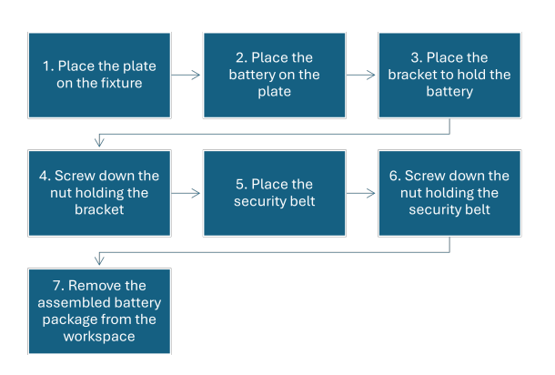
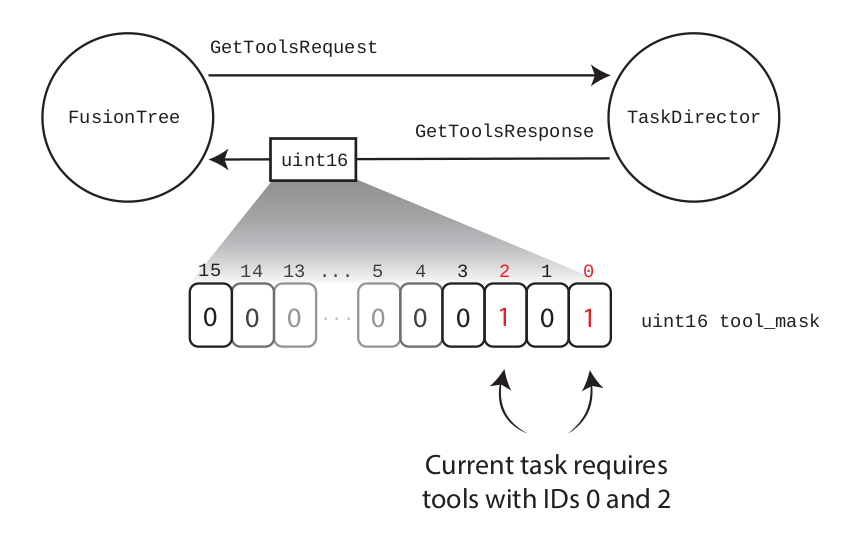

# Task Director

This package includes a ROS1 service interface in python for monitoring an assembly pipeline. The module is responsible for holding and controlling status information of the current assembly process. 

The user must define the tasks and related detections separately in .json files, and replace the path definitions for the files in `task_server` file: 

- `detections.json` - includes the detections; detection ID, name, fault and recovery definitions

- `fault_detections.json` - includes the fault detections; fault ID, name, fault and recovery definitions

- `tasks.json`: includes the tasks; task ID, instructions, tools, required detections and fault detections

Example for  `.json` files can be found in `src/misc_files` directory. 

## Classes

The package includes three distinct Python classes; `TaskDirector`, `TaskDetectorBuffer`and `TaskPipeline`.

`TaskDirector` holds ROS1 servers to control the `TaskPipeline` and performs visual inspection routines for the assembly process. The director resets the pipeline when corresponding ROS1 service is called, returns the current task progress and verifies the current task when requested similarly.

`TaskPipeline` is a simple class to manipulate an integer task mask. The task mask has indices for each sequential task, and the bits are flipped for already finished tasks. The class has getters for the current task and progress as a whole and methods for reset and verifying the current task by bitshifting. 

`TaskDetectorBuffer` has the callback function for detection messages and `is_detected()` method to decide, whether related detections or faults are detected. By default the buffer holds 100 samples and takes mean over 30 sample scores to define whether the detection threshold is surpassed. 

## ROS1 Services

The following ROS1 services are implemented within the package and can be used for e.g., pooling the current task progress, faults, and controlling the process. Detailed message definitions can be found under `srv/` directory.  

| Service       | Request description                                                                              |
| ------------- | ------------------------------------------------------------------------------------------------ |
| GetTools      | Tools for the current task                                                                       |
| Inspection    | Can the current task be verified; does the visual inspection detect faults, what is the recovery |
| IsFault       | Is a fault detection detected for any of the already performed tasks                             |
| ResetProgress | Reset the current progress; return to step 1                                                     |
| TaskProgress  | Current task progress                                                                            |
| VerifyTask    | Verify the current task done; move to next step                                                  |

To keep ROS1 services lightweight, tools and task progress are delivered using uint16 masks. The mask handling is done with bit operations such as bit shifting. 

